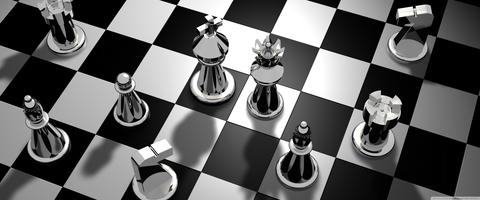
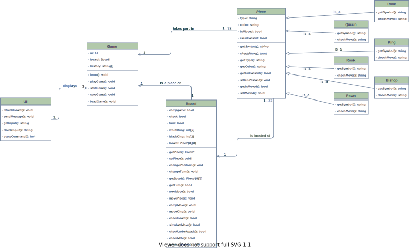
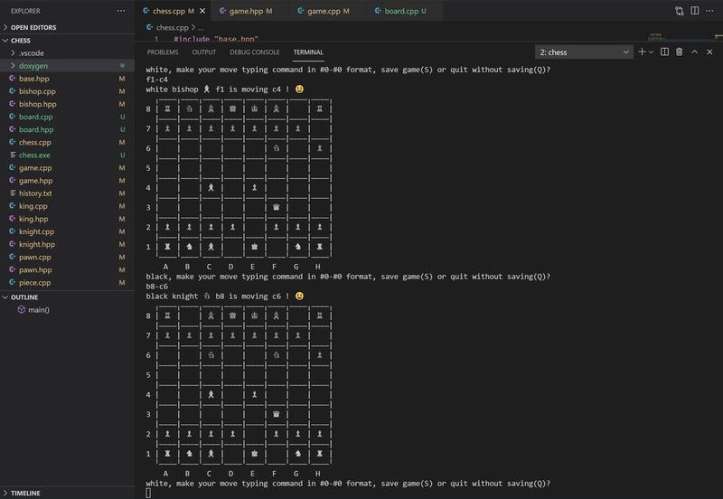

# Chess app

[TOC]  

    

**Table of Content (markdown)**
* [Getting Started](#getting-started)
* [Class diagram](#class-diagram)
* [Description in Polish](#description-in-polish)
	* [Klasa Game](#klasa-game)
	* [Klasa Board](#klasa-board)
	* [Klasa Piece](#klasa-piece)
	* [Klasa UI](#klasa-ui)
* [Screenshot](#screenshot)
  

[Doxygen documentation](index.html) 
* [Annotated class list](annotated.html)  
* [Class index](classes.html)  
* [Class Hierarchy](hierarchy.html)
* [Files list](files.html)
  

## Getting Started
 

Simple console chess app using C++ and object-oriented approach
 

Main features:
* Two-player mode
* Computer mode (random moving)
* Game saving and loading
* En Passant
* Castling
* Promotion
  

## Class diagram
 

 

## Description in Polish
&nbsp;&nbsp;&nbsp;**chess.cpp - plik główny z metodą main**
 

### Klasa Game
&nbsp;&nbsp;&nbsp;**game.cpp - sterowanie przebiegiem gry**

| <!-- -->            | <!-- -->                                  |
|---------------------|-------------------------------------------|
| void intro()        | - wprowadzenie do gry                     |
| void playGame()     | - zapisywanie niedokończonej partii       |
| void loadGame()     | - odtwarzanie zapisanej wcześniej partii  |
| void saveGame()     | - zapisywanie niedokończonej partii       |
| void startGame()    | - rozpoczęcię partii                      |
 

### Klasa Board
&nbsp;&nbsp;&nbsp;**board.cpp - weryfikacja ogólnych zasad gry na szachownicy**

**Metody klasy**

| <!-- -->                   | <!-- -->                                                                   |
|----------------------------|----------------------------------------------------------------------------|
| Piece* getPiece()          | - zwracanie obiektu bierki z pola szachownicy                              |
| void setPiece()            | - tworzenie nowej bierki na szachownicy                                    |
| Piece*[8][8] getBoard()    | - zwracanie całej szachownicy                                              |
| string getTurn()           | - sprawdzanie bieżącej kolei ruchu                                         |
| void changeTurn()          | - zmiana kolej ruchu                                                       | 
| bool nextMove()            | - wykonanie posunięcia                                                     |
| void moveKing()            | - zapisywanie zmiany pozycji króla                                         |                   
| bool checkBoard()          | - sprawdzanie czy można wykonać posunięcie pomiędzy tymi polami            |
| void changePosition()      | - zmiana pozycji bierki na szachownicy                                     |  
| void saveMove();           | - zapisywanie posuniecia                                                   |
| bool simulateMove();       | - sprawdza czy nie zostanie własny król szachowany po wykonaniu posunięcia |
| bool checkUnderAttack();   | - sprawdzanie czy nie jest król szacowany                                  |
| bool checkMate();          | - sprawdzanie czy nie jest mat                                             |
| bool compMove();           | - wykonanie posunięcia przez komputera                                     |
| bool promotePawn();        | - wykonanie promocji piona                                                 |
 

### Klasa Piece
&nbsp;&nbsp;&nbsp;**piece.cpp - klasa abstrakcyjna obejmująca wszystkie typy bierek**
 

**Metody wirtualne, nadpisywane w klasach pochodnych:**

| <!-- -->            | <!-- -->                           |
|---------------------|------------------------------------|
| bool checkMove()    | - wykonanie    posunięcia bierki   |
| string getSymbol()  | - zwracanie kolor bierki           |
 

**Metody ogólne:**

| <!-- -->             | <!-- -->                                     |
|----------------------|----------------------------------------------|
| string getType()     | - zwracanie rodzaj bierki                    |
| string getColor()    | - zwracanie kolor bierki                     |
| bool getEnPassant()  | - sprawdzanie czy pion mozna bić w przelocie |
 

**Klasy dziedziczące:**

| <!-- -->              | <!-- -->      |
|-----------------------|---------------|
| bishop.cpp            | - goniec      |
| king.cpp              | - król        |
| knight.cpp            | - skoczek     |
| queen.cpp             | - hetman      |
| pawn.cpp              | - pion        |
| rook.cpp              | - wieża       |
 

### Klasa UI
&nbsp;&nbsp;&nbsp;**ui.cpp - wyświetlenie szachownicy i interfejsu użytkownika na konsoli**

| <!-- -->              | <!-- -->                                                |
|-----------------------|---------------------------------------------------------|
| void sendMessage()    | - wyświetlinie komunikatów dla graczy                   |
| string getInput()     | - wczytywanie poleceń                                   |
| string checkInput()   | - weryfikacja poleceń                                   |
| int* parseCommand()   | - rozpoznawanie poleceń                                 |
| void refreshBoard()   | - odświeżenie szachownicy po wykonanych posunięciach    |
| void roof())          | - rysowanie górnej chęści szachownicy                   |
| void ceiling()        | - rysowanie centaralnych elementów szachownicy          |
| void floor()          | - rysowanie dolnych elementów szachownicy               |
 

## Screenshot
 

  
 
